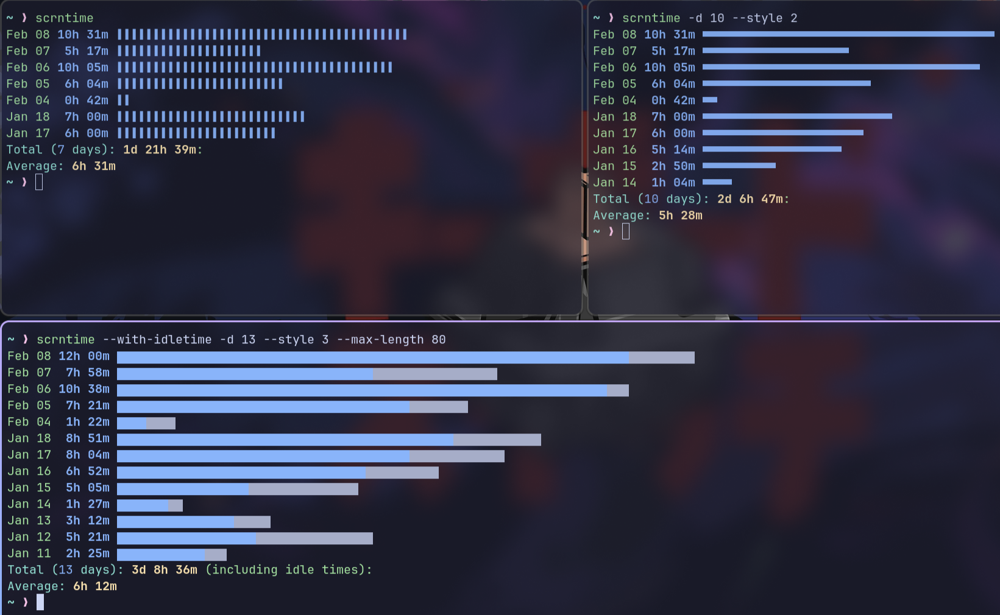

# scrntime

**scrntime** is a command-line tool that displays your daily screen time usage over n days. By parsing system reboot logs (using the `last reboot` command) and **subtracting idle/afk time**



## Features

- **Daily Screen Time Tracking:** Calculates screen time per day based on system reboot logs.
- **Idle Time Integration:** Subtract idle times from the total screen time(optional).
- **Customizable Visualization:** Choose multiple styles and adjust max length
- **Idle Time Management:** Add idle time management using `xprintidle`(for Xorg), `hypridle` or `swayidle`.

## Prerequisites
- `python` Ensure that Python 3 is installed on your system.

## Installation
```bash
git clone https://github.com/sahaj-b/scrntime.git
cd scrntime
# Usage:
pytyhon3 scrntime.py --help
```

#### Add to path for global usage
```bash
chmod +x scrntime.py
sudo cp scrntime.py /usr/local/bin/scrntime/scrntime
# Usage:
scrntime --help
```

## Setup Idle Time Management
`scrntime` doesn't have a built-in idle time tracker. However, you can use the following tools with `scrntime` to track idle time by storing idle times in a file (default: `~/.idletimes`):
  - ### Xorg - `xprintidle`
    coming soon

  - ### Hyprland - `hypridle`
    - Install [hypridle](https://wiki.hyprland.org/Hypr-Ecosystem/hypridle/)
    - Add this snippet to `~/.config/hypr/hypridle.conf`:
    ```conf
    listener {
        timeout = 150 # 2.5 minutes
        on-timeout = echo $(( $(date +%s) - 150 )) > /tmp/idle
        on-resume = scrntime -a $(( $(date +%s) - $(cat /tmp/idle) ))
    }
    ```
    - start `hypridle` in background by running `hypridle & disown` command
    - Autostart `hypridle` on startup by adding `exec-once = hypridle` to `~/.config/hypr/hyprland.conf`

  - ### Sway - `swayidle`
    - Install [swayidle](https://github.com/swaywm/swayidle)
    - Run this command
    ```bash
    swayidle -w \
        timeout 150 'echo $(( $(date +%s) - 150 )) > /tmp/idle' \
            resume 'scrntime -a $(( $(date +%s) - $(cat /tmp/idle) ))'
    ```
    - Add this command to your sway config for autostart
